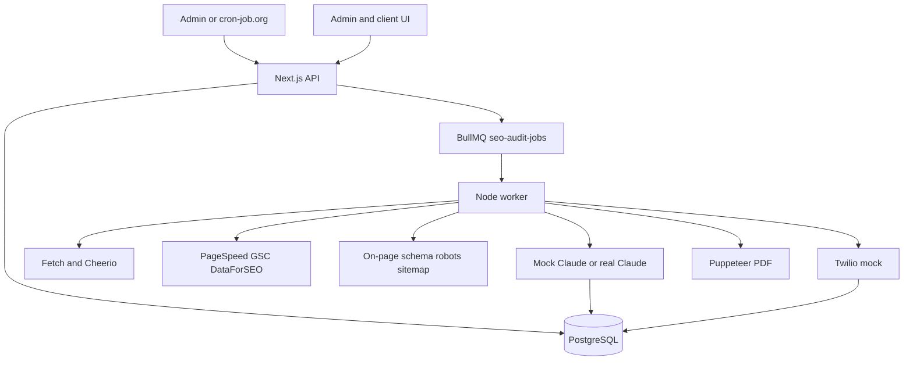

# Architecture

## System

The browser never receives database URLs, Redis credentials, or API keys. Server modules own Prisma, BullMQ, crawling, Claude, and PDF generation.

## Request flow

1. Demo or password login sets an HMAC session cookie.
2. Middleware checks that cookie for `/admin`, `/dashboard`, and `/api`, except login, health, and cron.
3. Creating an audit validates the body, checks the URL, upserts the website, inserts `Audit` and `AuditJob` as `QUEUED`, then adds a BullMQ job.
4. If Redis is down, the audit is stored as `FAILED` and the API returns 503 instead of leaving a silent queue.

## Queue flow

Queue name: `seo-audit-jobs`.

Jobs carry `{ auditId }`, retry three times with exponential backoff, and update `progress` on the audit row. The worker is `src/workers/index.js`. It refuses probe jobs used by tests and skips audits that are already `COMPLETED`.

## Audit pipeline

1. Crawl the URL with redirect and SSRF checks.
2. PageSpeed.
3. Google Search Console.
4. Schema.org JSON-LD.
5. On-page analysis.
6. robots.txt and sitemap.xml.
7. DataForSEO rankings.
8. Mock Claude when `USE_REAL_CLAUDE` is not `true`. Real Claude when `USE_REAL_CLAUDE=true`, even if the other providers are mocked.
9. Validate JSON, then save signals and the result.
10. Render the PDF.
11. WhatsApp mock and email log.
12. Mark `COMPLETED`.

External signal failures are stored on the signal row and the audit continues. Crawl failures are data, not a crash. PDF, database, and delivery failures fail the job and retry when the error looks transient.

Statuses exposed to the product are `QUEUED`, `CRAWLING`, `ANALYZING`, `GENERATING_REPORT`, `DELIVERING`, `COMPLETED`, and `FAILED`. `currentStep` keeps the finer stage name.

## Database

- `Client` and `Website` hold who is being audited.
- `Audit` holds status, progress, step, timestamps, and the BullMQ job id.
- `AuditJob` is the visible job history.
- `AuditSignal` stores crawl, on-page, technical, schema, robots, PageSpeed, GSC, and ranking JSON.
- `AuditResult` stores the validated score and recommendations.
- `Report` points at the local PDF.
- `DeliveryLog` records WhatsApp and email attempts.

The schema is a production model for this assessment. The supplied brief did not include a literal Prisma file, so this is not claimed as an official pasted schema.

## Mock architecture

`src/mocks/index.js` exports `USE_MOCKS` from `process.env.USE_MOCKS === 'true'`. Integration functions in `src/services/integrations.js` return the sample modules when that flag is on and call the real HTTP APIs when it is off. Replacing a provider means editing that one function.

## Claude flow

The system prompt and user prompt live in `src/ai/prompt.js`. Real Claude output is parsed, normalized, and checked for score bounds, enums, list caps, quick-win effort, and a three-sentence summary. Invalid output is retried once. If that retry fails, the audit fails and the mock brief is not substituted. `USE_MOCKS=true` never calls Claude. The default brief comes from `src/services/claude/claude.mock.js`.

## Report flow

`src/reports/template.js` escapes every interpolated value. Puppeteer prints that HTML on the worker. `src/services/storage.js` uploads the PDF to a private Supabase Storage bucket when `SUPABASE_URL` and `SUPABASE_SERVICE_ROLE_KEY` are set. Local development writes the same basename under the OS temp reports directory. The download route checks the session and reads through that same storage module.

## Deployment

Vercel hosts the Next.js UI, API routes, and the BullMQ producer. Supabase hosts PostgreSQL and the private Storage bucket. Upstash hosts Redis. cron-job.org calls `POST /api/cron/audits`. A separate Node service runs `npm run worker`, because a serverless function cannot stay subscribed to BullMQ. The worker and Vercel must share `REDIS_URL`, `DATABASE_URL`, and the Storage credentials.

## Security

- URLs must be http(s), cannot embed credentials, and cannot target localhost, `.local`, or private IP ranges.
- Redirect hops are checked again before they are followed.
- Cron requires `CRON_SECRET`.
- Sessions are HMAC signed and httpOnly.
- AI output is schema-checked.
- Report names cannot escape the storage prefix, and the Storage key is never sent to the browser.
- Audit creation is rate limited.
